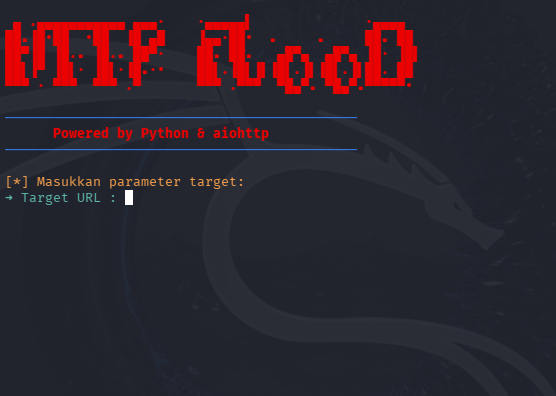

# Async HTTP Flood Tool (Educational Purposes Only)

Sebuah script Python berbasis `async/await` untuk melakukan *stress test* atau *load testing* pada server HTTP menggunakan modul `aiohttp`.

---

## Fitur

- Asynchronous HTTP flooding dengan `aiohttp`
- Random User-Agent untuk setiap request (simulasi trafik nyata)
- Loop terus-menerus untuk beban berkelanjutan
- Jumlah request & koneksi bersamaan dapat diatur

---

## Preview Aplikasi

<p align="center">
  
</p>

<p align="center">
  <i>Example CLI Tools</i>
</p>

---

## Instalasi

```bash
git clone https://github.com/pangeran-droid/HTTP-Flood-Attack.git
cd HTTP-Flood-Attack
pip install aiohttp
chmod +x tester.py
./tester.py
```

> Di Windows, gunakan `python tester.py` saja (tanpa angka 3) jika `python3` tidak dikenali.

---

## ⚠️ DISCLAIMER

**Alat ini dibuat hanya untuk tujuan pembelajaran dan riset.**

### ✅ Diperbolehkan untuk:

- Menguji ketahanan server milik sendiri
- Simulasi beban sebelum server dipublikasikan
- Belajar konsep asynchronous di Python

### ❌ Dilarang keras digunakan untuk:

- Menyerang atau membuat sistem orang lain menjadi down
- Aktivitas ilegal atau yang melanggar hukum

> ⚖️ **Segala bentuk penyalahgunaan alat ini adalah tanggung jawab pengguna sepenuhnya. Developer tidak bertanggung jawab atas tindakan ilegal yang dilakukan dengan script ini.**


